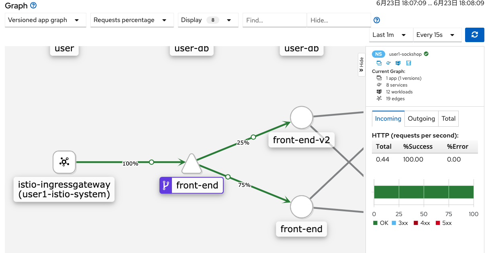

# SockShopへのService Meshの導入

## 事前準備（管理者向け）
Service Meshのコントロールプレーンをインストールするには、いくつかのOperatorの事前のインストールが必要です。
下記のOperatorのインストールを済ませておきましょう。

- Jaeger operator
- ElasticSearch operator
- ServiceMesh operator
- Kiali operator

## Service Meshのインストール
Service Mesh本体（コントロールプレーン）をインストールします。  
Service Meshのコントロールプレーン自体もOperatorを使ってインストールすることが可能です。
kialiのPodまで立ち上がっていれば、インストールは成功です。

```
$ oc new-project $OCP_USER-istio-system
$ cd service-mesh
$ cat istio-control-plane.yaml
apiVersion: maistra.io/v1
kind: ServiceMeshControlPlane
metadata:
  name: basic-install
spec:
  istio:
    global:
      disablePolicyChecks: false
      mtls:
        enabled: false
...

$ oc apply -f istio-control-plane.yaml -n $OCP_USER-istio-system
$ oc get pod -n $OCP_USER-istio-system
NAME                                      READY   STATUS    RESTARTS   AGE
grafana-7df65c57d5-8tzqn                  2/2     Running   12         5d19h
istio-citadel-54fc4655b4-hb28n            1/1     Running   6          5d19h
istio-egressgateway-6bb97d479d-smwck      1/1     Running   2          29h
istio-galley-797746b78d-b5vxv             1/1     Running   6          5d19h
istio-ingressgateway-66fcccb49d-c4s9d     1/1     Running   0          140m
istio-pilot-567c947974-xjp8l              2/2     Running   4          29h
istio-policy-5fcfd5f79c-7rk44             2/2     Running   5          29h
istio-sidecar-injector-75577f4fdb-gz9vk   1/1     Running   6          5d19h
istio-telemetry-dbc897cbb-v7sv9           2/2     Running   5          29h
jaeger-778bcb6bf4-t8n6t                   2/2     Running   12         5d19h
kiali-78b6f44646-pqzq8                    1/1     Running   1          17h
prometheus-884ff6bf9-5mbh7                2/2     Running   12         5d19h
```

## SockShopへの適応
### SockShopをmember rollに追加
インストールしたコントロールプレーンが対象とする範囲を決めます。
`ServiceMeshMemberRoll`と呼ばれるカスタムリソースで設定できます。
今回はひとつのsockshopアプリケーションのProjectのみとなります。  
`configureMembers`に`userX-sockshop`が含まれていればメンバー追加ができています。

```
// userX を修正の上、マニフェストapplyする
$ oc apply -f member-roll.yaml -n $OCP_USER-istio-system
servicemeshmemberroll.maistra.io/default created

$ oc get ServiceMeshMemberRoll default -o yaml | grep -A 1 configuredMembers
  configuredMembers:
  - userX-sockshop
```

この時点で、今まで通りRoute経由でSockShopへはアクセスできなくなります（確認してみましょう）。  
理由は、NetworkPolicyの設定でRouterから直接の通信は遮断されているからです。IstioのIngress Gatewayを利用してアクセスするように設定変更をする必要があります。

```
$ oc get networkpolicy -n $OCP_USER-sockshop
NAME                 POD-SELECTOR                   AGE
istio-expose-route   maistra.io/expose-route=true   70s
istio-mesh           <none>                         70s

$ oc get networkpolicy -n $OCP_USER-sockshop istio-mesh -o yaml
...
spec:
  ingress:
  - from:
    - namespaceSelector:
        matchLabels:
          maistra.io/member-of: user1-istio-system
...
```

この時点でアクセスしたい場合は、ポートフォワードを活用すると良いです。

```
$ oc port-forward service/front-end 8080:80 -n $OCP_USER-sockshop
Forwarding from 127.0.0.1:8080 -> 8079
Forwarding from [::1]:8080 -> 8079
```

### 各サービスへEnvoy Proxyを導入
Service Meshの要である、Envoy Proxyを各アプリケーションに配置していきます。
deploymentのannotationsに `"sidecar.istio.io/inject": "true"` を入れることで、[Admission Controller](https://kubernetes.io/docs/reference/access-authn-authz/admission-controllers/)がPodに対して、自動的にサイドカーコンテナとしてEnvoy Proxyを注入します。 
すべてのデプロイメントに対して、annotationsをpatchしていきます。  
※本環境では、永続ボリュームを利用していないため、Podが再デプロイされたタイミングで以前に保存したデータが削除される点ご注意ください。

```
$ for deployment_name in $(oc get deploy -n $OCP_USER-sockshop | sed '1d' | awk '{print $1}')
do
    oc patch deploy $deployment_name --type='json' -p "[{\"op\": \"add\", \"path\": \"/spec/template/metadata\", \"value\": {\"annotations\":{\"sidecar.istio.io/inject\": \"true\"}, \"labels\":{\"name\":\"$deployment_name\",\"version\":\"v1\"}}}]" -n $OCP_USER-sockshop
done

deployment.extensions/carts patched
deployment.extensions/carts-db patched
deployment.extensions/catalogue patched
deployment.extensions/catalogue-db patched
deployment.extensions/front-end patched
deployment.extensions/orders patched
deployment.extensions/orders-db patched
deployment.extensions/payment patched
deployment.extensions/queue-master patched
deployment.extensions/rabbitmq patched
deployment.extensions/shipping patched
deployment.extensions/user patched
deployment.extensions/user-db patched
```

ぜひPodの状態を確認してみましょう。  
Pod内のコンテナ数が`2/2`と変化していることが確認できるはずです。

```
$ oc get pod -w -n $OCP_USER-sockshop
NAME                            READY   STATUS    RESTARTS   AGE
carts-775b5b784b-cmfn7          2/2     Running   0          6h3m
carts-db-7976bd95d4-zshrt       2/2     Running   0          6h3m
catalogue-7bbd76d66-sszxj       2/2     Running   0          5h30m
catalogue-db-74594d89f8-n8fd7   2/2     Running   0          33s
front-end-665658854d-n5vc8      2/2     Running   0          6h3m
orders-74dd49b86c-d2mvr         2/2     Running   0          6h3m
orders-db-58554f4464-jmbqg      2/2     Running   0          6h3m
payment-56cb9cd8fb-n47jj        2/2     Running   0          6h3m
queue-master-55ddb495d7-bm2pm   2/2     Running   0          6h3m
rabbitmq-9cb6c88f5-8d44b        2/2     Running   1          6h3m
shipping-7d68cc8c75-hmk82       2/2     Running   0          6h3m
user-759b999dd9-g7bc7           2/2     Running   0          6h3m
user-db-678f7786ff-g5dl7        2/2     Running   0          28s
```

### Ingressトラフィックの切り替え
Service Meshのハンズオン以前では、Routeが直接にfront-endサービスにアクセスすることでアプリケーションを公開していました。
上で見たように、現在はNetworkPolicyによってistioのコントロールプレーンからアクセスできるようになっており、ネットワーク経路を変更する必要があります。  
これらの変更を行うために、[VirtualService](https://archive.istio.io/v1.4/docs/reference/config/networking/virtual-service/)、[Gateway](https://archive.istio.io/v1.4/docs/reference/config/networking/gateway/)、Routeの設定をしていきます。(VirtualService, GatewayはIstioのカスタムリソースです。)

- VirtualService
  - トラフィックのルーティングルールに関する設定で、istio内のingressと理解するとわかりやすい。ホスト名、Gateway、バックエンドのサービスなどを設定する。istioコントロールプレーンのingress-gatewayから入ってきたトラフォックをコントロールするために存在する。
- Gateway
  - ロードバランシングに関する設定。待ち受けるポートやドメイン名などを指定する。Gatewayで受け付けたトラフィックをVirtualServiceのルールに基づいてルーティングすると考えるとわかりやすい。


```
// spec.hosts と spec.http.route.destination.host 内の値を適切なもの変更
$ vim front-end-virtualservice.yaml
  hosts:
    - front-end-user1-sockshop.apps.cluster-6a92.6a92.sandbox595.opentlc.com
  ...
    - destination:
        port:
          number: 80
        host: front-end.user1-sockshop.svc.cluster.local

$ oc apply -f front-end-virtualservice.yaml -n $OCP_USER-sockshop
virtualservice.networking.istio.io/front-end-virtualservice created

$ oc get virtualservice -n $OCP_USER-sockshop
oc get virtualservice
NAME                       GATEWAYS                      HOSTS                                       AGE
front-end-virtualservice   [sockshop-wildcard-gateway]   [front-end-user1-sockshop.apps.xxxxx.com]   28s
```

続いてGatewayを作成。

```
// もしhostsのドメインが異なっていれば変更
$ vim gateway.yaml
...
    hosts:
    - "*.apps.cluster-6a92.6a92.sandbox595.opentlc.com"

$ oc apply -f gateway.yaml -n $OCP_USER-sockshop
gateway.networking.istio.io/sockshop-wildcard-gateway created

$ oc get gateway -n $OCP_USER-sockshop
NAME                        AGE
sockshop-wildcard-gateway   40s
```

既存のrouteを削除し、新しくingress-gateway経由のrouteを作成。

```
//既存のRoute削除
$ oc delete route front-end -n $OCP_USER-sockshop

// userX を適切なものに変更する
$ vim front-end-route.yaml
spec:
  host: front-end-user1-sockshop.apps.cluster-6a92.6a92.sandbox595.opentlc.com

// Routeの作成(istioコントロールプレーン側に作成)
$ oc apply -f front-end-route.yaml -n $OCP_USER-istio-system
route.route.openshift.io/front-end-service-gateway created

$ oc get route front-end-service-gateway -n $OCP_USER-istio-system
NAME                        HOST/PORT                                                                PATH   SERVICES               PORT   TERMINATION   WILDCARD
front-end-service-gateway   front-end-user1-sockshop.apps.cluster-6a92.6a92.sandbox595.opentlc.com          istio-ingressgateway   8080                 None
```

新しく作成した`front-end-service-gateway`のRouteのホストに対してアクセスし無事にSockShopアプリケーションの画面が出てくれば設定は成功です。  
`Route -> ingress-gateway -> front-end service` でアクセスがされています。

## Kialiによるトラフィックの可視化
この時点で一度Kialiにログインをし、Envoy Proxyを導入したことによる恩恵を確認してみよう。
Ingress Gatewayからのトラフィックを可視化できていることを確認できます。


## レジリエンス
cartsサービスを落とした際に、応答しないcartsサービスのタイムアウトを長い間待っていました。
各アプリケーション側で適切にタイムアウトを適切に設定することも非常に重要ですが、一定時間落ちているサービスに対してタイムアウトを待つことやアクセスを試みること自体が無駄とも言えます。
サーキットブレーカーの考え方を実装することで回避できますが、Istioではアプリケーションに実装することなくサービスメッシュ層でサーキットブレーカーを実装できます。

下記は、Istioを導入する前のcartsサービスを落としたときの、ネットワーク状況です。


Istioを導入後に同様のことを行うとどの様に変わるか確認してみましょう。  
確認が終了したら、cartsサービスをもとに戻して復旧させましょう。

デフォルトの設定でも、Envoy Proxyが接続先のサービスの状態に応じて長い時間待つことなく504を返してくれますが、より詳細のサーキットブレーカーの設定を行うには、DestinationRuleで設定が可能です。
https://istio.io/latest/docs/reference/config/networking/destination-rule/#OutlierDetection

## トラフィック制御
複数バージョンある、front-endのサービスのトラフィック比率の変更を行うことも可能です。  
まず、front-endサービスを複数バージョンでリリースします。
複数バージョンをリリースしたのち、ブラウザからアプリケーションにアクセスしてみましょう。おそらく、ランダム（50％程度の確立）で、新旧のバージョンが表示されるのではないかと思います。

```
// 既存に動いているfront-endサービスを異なるimageを指定（背景が黄色のバージョン）
$ cat front-end-v2.yaml | grep image
        image: mosuke5/front-end:master-49c0d1f

// v2のリリース(v1と共存)
$ oc apply -f front-end-v2.yaml -n $OCP_USER-sockshop
$ oc get pod -n $OCP_USER-sockshop | grep front-end
front-end-55cdb5dd8d-j7pg8           2/2     Running   0          100m
front-end-v2-647dbd4ccc-dp778        2/2     Running   0          97m
```

この状態に、トラフィック比率のコントロールを設定します。  
`DestinationRule` に `Subsets` 分散先を登録します。
`VirtualService` にその重みやルールを設定していきます。  
このハンズオンでは、Session Affinityの機能を利用しませんが、利用することで特定のセッションを継続して特定のバージョンのサービスに振ることも可能で、A/Bテストなどに利用しやすくなります。

まずはfront-endの行き先の設定(`DestinationRule`)をします。

```
// userXを変更。
$ vim front-end-destinationrule.yaml
spec:
  host: front-end.userX-sockshop.svc.cluster.local

$ oc apply -f front-end-destinationrule.yaml -n $OCP_USER-sockshop 
```

続いて、実際のトラフィックの分散ルールを更新します。

```
// userXを変更(3箇所あります)
$ vim front-end-virtualservice-v2.yaml

$ oc apply -f front-end-virtualservice-v2.yaml -n $OCP_USER-sockshop

// 自動で定期的にアプリケーションにアクセスするようにする
$ watch curl xxxxxxxxx.com
```

kialiでトラフィックの分散の様子を確認してみましょう。  
トラフィックの比率を表示するとおおよそ80:20で流れていることを確認できるはずです。
kialiのGraphにて`No edge label`を`Requests percentage`に変更するとトラフィックの比率が表示されます。



## トラフィックモニタリング
Istioでは、トラフィックデータをPrometheusに送信し管理できます。
GrafanaでダッシュボードWorkload情報を確認できます。

